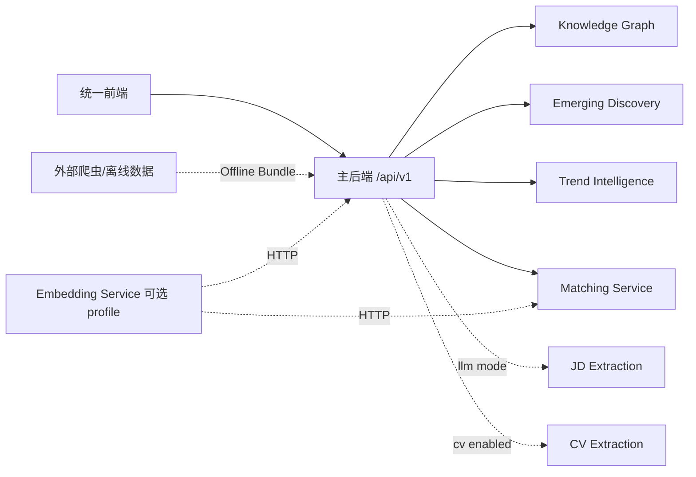

# 系统总览

JobPulse 采用“统一前端 + 主后端聚合编排 + 独立能力服务”的结构。各有状态服务独立拥有数据库、迁移与事务，跨服务通过 HTTP、稳定 DTO 或 Outbox 集成。



## 核心职责

- 主后端：账号/RBAC、JD/CV 生命周期、企业招聘、审核/治理、跨服务 BFF 与任务编排。
- Knowledge Graph：Published Fact、Evidence、GraphVersion、Position Profile、Review/Publish。
- Emerging Discovery：discovery.v2 因果运行（EMERGE v3.2）、Cluster、Candidate/Observation、Identity、Admission、Lifecycle、Lineage。
- Trend Intelligence：多源趋势信号、历史序列、预测/变化分析。
- Matching：正式多维评分、Gap、What-if、Learning Path、Evaluation。
- Extraction：JD/CV 抽取 Provider；rule JD Provider 在主系统存在 deterministic 路径，LLM Provider 由可选服务提供。
- 爬虫/采集：独立上游工具；`full` profile 通过主后端的 Crawler Gateway、共享 Bundle 目录和
  Offline Bundle importer 形成校验、幂等导入 `SourceJD/SourceJDVersion` 的链路，但仍需要
  站点凭据、授权和采集任务，不宣称自动获得持续稳定的在线市场数据流。

## 当前关键链路

```text
Offline JD Bundle -> SourceJD/Version -> Extraction/Normalization/Review -> Publication -> KG Profile
CV -> extraction/review -> ValidatedCVSnapshot
Published/Enterprise Profile + CV -> Matching -> Gap -> What-if -> Learning Path
EnterpriseJob JD -> formal EnterpriseJobProfile -> Evaluation -> Enterprise Board
GraphVersion -> Evolution / Trend
Published facts -> EMERGE v3.2 discovery
```

## 功能边界

- Evolution 只基于已发布 GraphVersion 与 Evidence 生成事件；聚合事件必须保留 coverage 指标，不能把样本覆盖变化直接解释为岗位能力变化。
- Trend 拥有来源、历史、分析、预测、配置、回放与评估数据；主后端只提交任务和投影结果。
- Emerging 的发现运行、输入/算法快照、Identity、Admission、Lifecycle 与 Lineage 由
  独立服务持久化；正式判定由 knowledge-graph 的 EMERGE v3.2 策略执行，主后端负责
  候选治理投影、人工定义、发布和晋升。
- Matching 默认执行确定性正式评分；语义召回是可选 shadow/候选层，不能改变正式得分。Expected dimension 缺失会进入明确的不完整/不足语义。
- Enterprise Board 只读聚合正式 Evaluation；企业 JD/profile 或 CV source version 变化会使旧 Evaluation stale。
- Evidence RAG 只有在显式启用且 Embedding、Qdrant、LLM 均可用时运行，依赖失败时明确返回失败或证据不足，不回退为无引用回答。

## 运行边界

当前 Compose 默认编排统一前端、主后端、KG/Emerging/Trend/Matching API，
以及 KG build、Matching task/dispatcher、Trend、rule Extraction、Validation 和 KG Outbox
等异步角色。`model-extraction` profile 增加 JD LLM Provider 与 Extraction worker；
`cv-extraction` profile 同时启动 CV Provider 与独立 CV worker；
`semantic-demo` profile 同时启动 Embedding、Qdrant、语义 Matching API 与 vector worker。
`full` profile 是这些可选角色的组合入口。生产角色分母见
`infra/compose/production-parity.yaml`；爬虫调度仍输出离线 Bundle，不直接写入主后端数据库。

接口方向见 [system-interface-map.md](system-interface-map.md)，启动见
[../deployment/quickstart.md](../deployment/quickstart.md)。
